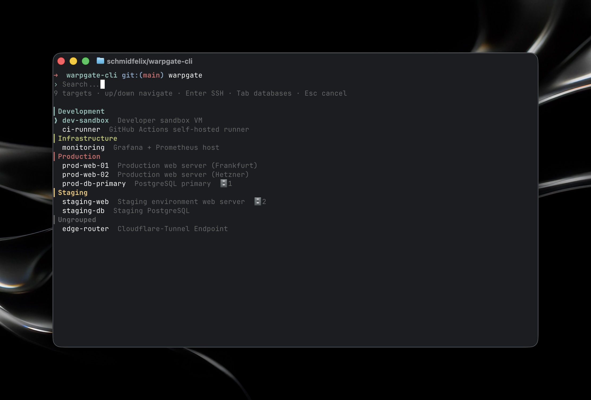
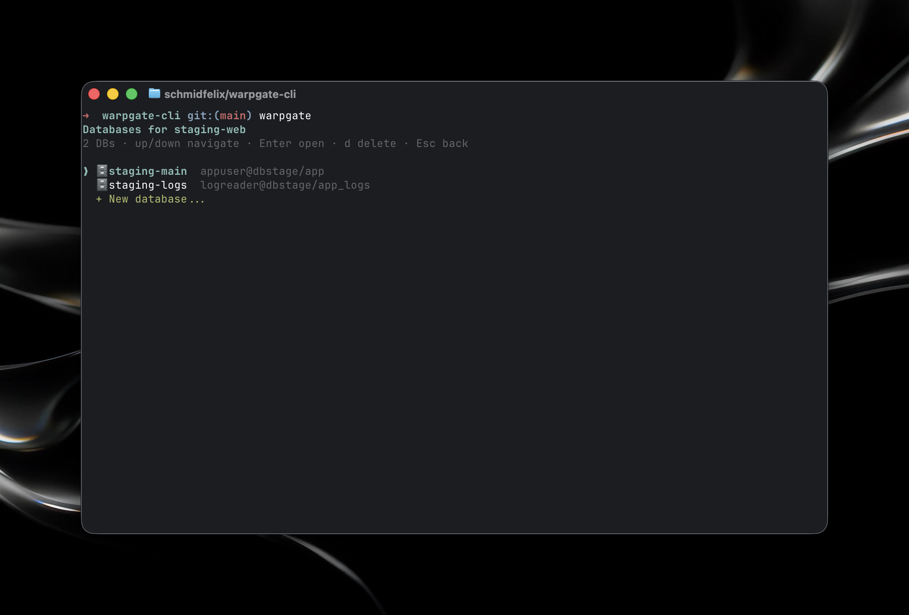

# warpgate-cli

> Quick-access TUI for [Warpgate](https://github.com/warp-tech/warpgate) SSH targets. Search, select, and connect in under a second.

`warpgate-cli` removes the need to look up target names in the Warpgate Web UI and manually type `ssh user:target@host -p port`. Press a key, search, hit Enter, and start the SSH session.

<!-- TODO: Add demo GIF / screencast here -->
<!--  -->

## Features

- Fuzzy search across all SSH targets by name, description, and group
- Grouping with the Bootstrap colors used by the Warpgate Web UI
- Token storage in the macOS Keychain instead of plaintext files
- First-run onboarding flow
- Shell wrapper for zsh, bash, and fish so SSH runs as a direct child process of your shell
- Database connections over SSH tunnels: open MySQL/MariaDB connections for a target in TablePlus from the picker

<!-- TODO: Add picker screenshot here -->
<!--  -->

## Requirements

- macOS for `security` / Keychain support
- [Bun](https://bun.sh) 1.0 or newer
- A reachable Warpgate instance and an API token from the Web UI under Profile -> API Tokens
- [TablePlus](https://tableplus.com/) for the optional database workflow

## Installation

### npm

```bash
npm install -g warpgate-cli
warpgate-cli setup-shell
```

Open a new shell after installing the wrapper, then run:

```bash
warpgate
```

### Build from source

```bash
git clone https://github.com/<github-user>/warpgate-cli.git
cd warpgate-cli
bun install
bun run build
mv warpgate-cli /usr/local/bin/
```

### Development link

```bash
bun install
bun link
```

## Shell Wrapper

`warpgate-cli` is a helper binary. The interactive command is provided by a small shell function:

```bash
warpgate-cli setup-shell
```

This adds a wrapper block to `~/.zshrc`, `~/.bashrc`, or `~/.config/fish/functions/warpgate.fish`.

The wrapper matters because SSH should run as a direct child process of your shell. That avoids TTY latency and keeps directives such as `SetEnv` from `~/.ssh/config` working as expected. The wrapper asks `warpgate-cli pick` to print a ready-to-run command and then evaluates it in the current shell.

## Usage

```bash
warpgate
```

On first run, the setup flow asks for the Warpgate URL and API token. After that, run `warpgate`, type to search, and press Enter.

### Picker Keys

| Key | Action |
| --- | --- |
| `Up` / `Down` | Move selection |
| `Enter` | Open SSH connection |
| `Tab` / `Right` | Show databases for the selected target |
| `Esc` / `Ctrl+C` | Cancel, or return to the main list from the database submenu |
| Letters | Live search |

### Subcommands

```bash
warpgate-cli login                # Set or refresh token
warpgate-cli logout               # Remove token and config
warpgate-cli user <username>      # Set Warpgate username manually
warpgate-cli setup-shell          # Install or update shell wrapper
warpgate-cli setup-shell --print  # Print wrapper snippet
warpgate-cli db                   # List database connections
warpgate-cli db add               # Add a database connection
warpgate-cli db remove <id|label> # Remove a database connection
warpgate-cli db edit   <id|label> # Edit a database connection
warpgate-cli help                 # Show help
```

### Manual Username

Some Warpgate setups do not return a username for token-based authentication through `/info`. In that case, onboarding asks for it, or you can set it later:

```bash
warpgate-cli user alice
```

## Databases

MySQL and MariaDB databases that are only reachable from an SSH target, such as an internal DNS name or `localhost`, can be attached to that target and opened in TablePlus. TablePlus creates the SSH tunnel through Warpgate and resolves the database host on the remote side.

<!-- TODO: Add database submenu screenshot here -->
<!--  -->

### Add A Database

In the picker, select an SSH target, press `Tab`, choose `+ New database...`, and complete the wizard.

From the CLI:

```bash
warpgate-cli db add                       # Pick a target, then run the wizard
warpgate-cli db add --target stage-web    # Add directly for this target
```

### Open A Database

```text
warpgate                    # Start picker
Up / Down                   # Select target
Tab                         # Open database submenu
Up / Down                   # Select database
Enter                       # Open TablePlus connection
```

`warpgate-cli` prints an `open '<tableplus-url>'` command to stdout. The shell wrapper evaluates that command, and TablePlus creates the SSH tunnel using your local SSH key with `usePrivateKey=true`.

### Manage Databases

```bash
warpgate-cli db                   # List all database connections grouped by target
warpgate-cli db edit stage-main   # Edit by label or UUID
warpgate-cli db remove stage-main
```

Connections for targets that no longer exist are shown as `(orphaned)` in `db list`. They are not deleted automatically.

### Storage

| Location | Contents |
| --- | --- |
| `~/.config/warpgate-cli/config.json` with mode `0600` | `baseUrl`, optional `username` |
| `~/.config/warpgate-cli/databases.json` with mode `0600` | Database metadata |
| macOS Keychain service `warpgate-cli` | API token |
| macOS Keychain service `warpgate-cli-db` | Database passwords |

Database entries remain when `warpgate-cli logout` runs. Logout only removes the Warpgate token. Remove database entries explicitly with `warpgate-cli db remove <id|label>`.

## Environment

| Variable | Effect |
| --- | --- |
| `WARPGATE_MOCK=1` | Use local fixtures from `test/fixtures/` instead of the real API |
| `WARPGATE_KEYCHAIN_SERVICE` | Override token Keychain service, default `warpgate-cli` |
| `WARPGATE_DB_KEYCHAIN_SERVICE` | Override database password Keychain service, default `warpgate-cli-db` |
| `WARPGATE_KEYCHAIN_BACKEND=memory` | Use an in-memory backend for tests |
| `FORCE_COLOR=1` | Set by the shell wrapper so colors survive command substitution |

## Development

```bash
bun install
bun test
bunx tsc --noEmit
WARPGATE_MOCK=1 bun run src/cli.tsx pick
```

### Project Structure

```text
src/
├── cli.tsx           # Entry point, subcommands, shell wrapper setup
├── api.ts            # Warpgate HTTP client and mock fixture loader
├── config.ts         # ~/.config/warpgate-cli/config.json
├── keychain.ts       # security CLI wrapper for tokens and database passwords
├── ssh.ts            # SSH connection and shell command builders
├── tableplus.ts      # TablePlus URL and open command builders
├── database.ts       # databases.json and DB Keychain helpers
├── colors.ts         # Bootstrap color to ink color mapping
├── fuzzy.ts          # Live-search scoring
├── types.ts          # API types and DatabaseEntry
└── ui/
    ├── Picker.tsx
    ├── Onboarding.tsx
    ├── DbSubmenu.tsx
    └── DbWizard.tsx
test/
├── config.test.ts
├── fuzzy.test.ts
├── ssh.test.ts
├── tableplus.test.ts
├── database.test.ts
└── fixtures/
```

## Troubleshooting

**`warpgate: command not found`**
Install the shell wrapper or reload your shell: `warpgate-cli setup-shell && exec $SHELL`.

**`Token was rejected`**
Check whether the token is still valid in the Warpgate Web UI, then run `warpgate-cli login`.

**`Username could not be determined`**
Set it manually with `warpgate-cli user <username>`.

**No colors in the picker**
Your shell wrapper may be outdated. Run `warpgate-cli setup-shell` again to update it in place.

**`password for DB '...' is missing from Keychain`**
The metadata entry exists, but its Keychain password was deleted or never written. Run `warpgate-cli db edit <label>` to write the password again.

**Conflict with another `warpgate` command**
The binary is intentionally named `warpgate-cli`. The `warpgate` command is only provided by the shell wrapper, so it can be removed by deleting the wrapper block from your shell config.

## Security Notes

- API tokens and database passwords are passed to the macOS `security` CLI as arguments because `security add-generic-password` accepts secrets that way. They may be visible briefly in process listings on the local machine.
- Config files are written with mode `0600`.
- TLS certificate validation relies on Bun's default `fetch` behavior.
- TablePlus URLs include the database password while the `open` command is running. This is brief, but worth considering on shared machines.

## License

MIT. See [LICENSE](LICENSE).

## Acknowledgments

- [Warpgate](https://github.com/warp-tech/warpgate), the proxy this tool works with
- [ink](https://github.com/vadimdemedes/ink), React for terminals
- [Bun](https://bun.sh), runtime and build tool
